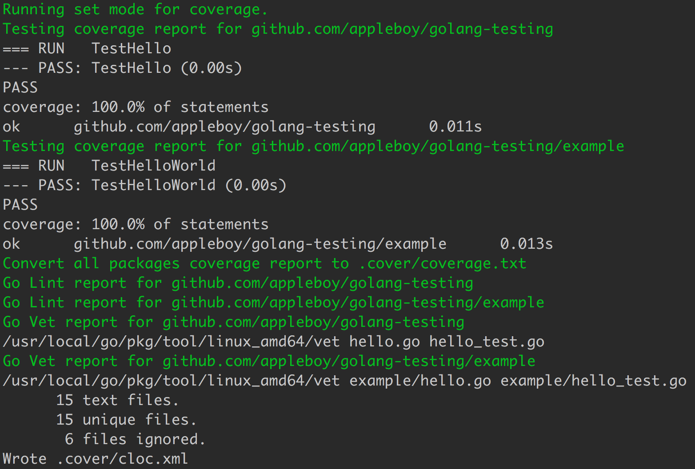

# golang-testing


**Docker image includes golang coverage tools for testing.**

[](https://travis-ci.org/appleboy/golang-testing) [](https://codecov.io/gh/appleboy/golang-testing) [](https://goreportcard.com/report/github.com/appleboy/golang-testing)

## Feature

The docker images includes the following `golang` tools.

* [x] [go-junit-report](https://github.com/jstemmer/go-junit-report) Convert go test output to junit xml
* [x] [gocov](https://github.com/axw/gocov/gocov) Coverage testing tool
* [x] [gocov-xml](https://github.com/AlekSi/gocov-xml) XML (Cobertura) export
* [x] [golint](https://github.com/golang/lint/golint) This is a linter for Go source code. (Golint requires Go 1.6 or later.)
* [x] [glide](https://github.com/Masterminds/glide) Package Management for Golang
* [x] [cloc](https://github.com/AlDanial/cloc) Count Lines of Code.
* [x] [blackfriday-tool](https://github.com/russross/blackfriday-tool) a markdown processor for Go.

## Install

Copy `coverage.sh` to `/usr/local/bin/coverage` and change permission.

```
$ curl https://raw.githubusercontent.com/appleboy/golang-testing/1.0.2/coverage.sh -o $GOPATH/bin/coverage
$ chmod +x $GOPATH/bin/coverage
```

## Usage

coverage tool document:

```
Generate test coverage statistics for Go packages.

  -- Command Flag --
  -h | --help                    Display this help and exit
  -m | --mode                    Set coverage mode. default is "set" (set|count|atomic)
  -d | --dir                     Set store coverage folder (default is ".cover")

  -- Command Action --
  tool                           Install go dependency tools like gocov or golint.
  testing                        Run go testing for all packages
  coverage                       Generate coverage report for all packages
  junit                          Generate coverage xml report for junit plugin
  lint                           Generate Lint report for all packages
  vet                            Generate Vet report for all packages
  cloc                           Generate Count Lines of Code report for all files
  all                            Execute coverage、junit、lint、vet and cloc report

Contribute and source at https://github.com/appleboy/golang-testing
```

## Run with docker

Pull the latest [golang-testing](https://hub.docker.com/r/appleboy/golang-testing/) docker image.

```
$ docker pull appleboy/golang-testing
```

### docker command

Run testing in single docker command.

```
$ export PROJECT_PATH=/go/src/github.com/appleboy/golang-testing
$ docker run --rm \
    -v $(PWD):$PROJECT_PATH \
    -w=$PROJECT_PATH \
    appleboy/golang-testing \
    sh -c "coverage all"
```

Change `PROJECT_PATH` variable. Replace `github.com/appleboy/golang-testing` with your github path.

### docker-compose command

Please see [docker/docker-compose.yml](./docker/docker-compose.yml) example file. Run the following command.

```
$ export PROJECT_PATH=/go/src/github.com/appleboy/golang-testing
$ docker-compose -f docker/docker-compose.yml run golang-testing \
  sh -c "coverage all"
```

## Demo

```
$ git clone https://github.com/appleboy/golang-testing.git
$ cd golang-testing
$ export PROJECT_PATH=/go/src/github.com/appleboy/golang-testing
$ docker run --rm \
    -v $(PWD):$(PROJECT_PATH) \
    -w=$(PROJECT_PATH) \
    appleboy/golang-testing \
    sh -c "make update && coverage all"
# or docker-compose command
$ docker-compose -f docker/docker-compose.yml \
    run golang-testing
```

## Screenshot


